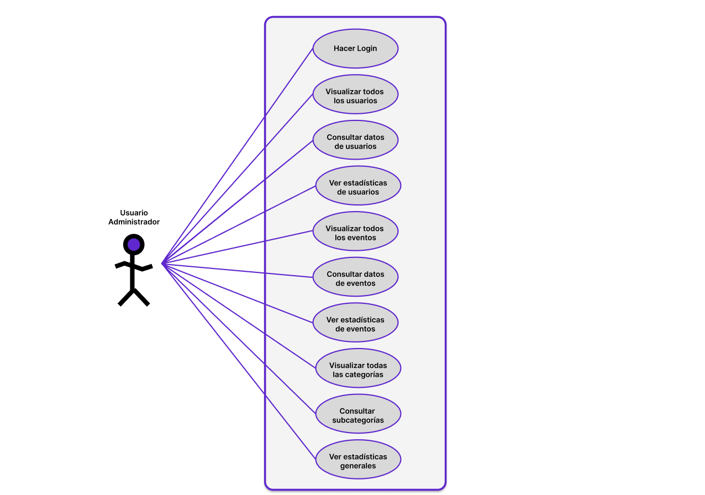
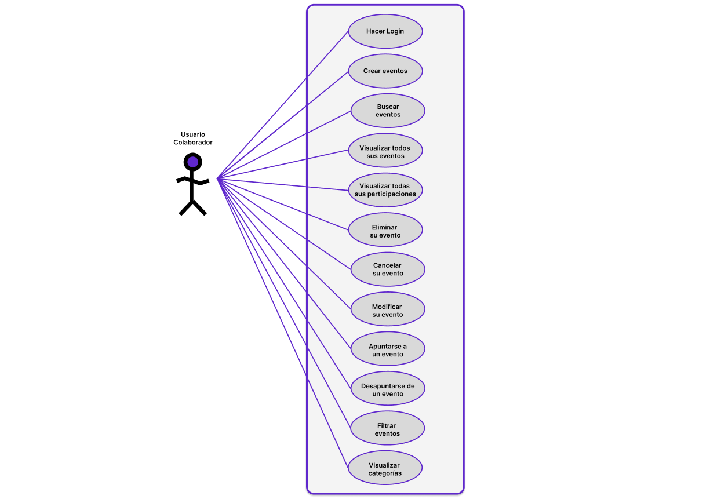

# Casos de Uso de la Aplicación: *EntreHobbies*

> [!NOTE]
> Este documento presenta los diferentes casos de uso contemplados para los perfiles de usuario dentro de la aplicaci&oacute;n, detallando sus funcionalidades y responsabilidades principales.

---

## Índice

1. [Casos de Uso - Usuario Administrador](#casos-de-uso---usuario-administrador)  
2. [Casos de Uso - Usuario Colaborador](#casos-de-uso---usuario-colaborador)

---

## Casos de Uso - Usuario Administrador

---

## Casos de Uso - Usuario Colaborador

---

🧑‍💻**Alumno:** *Alberto Miguel S&aacute;nchez Mac&iacute;as*

🧑‍🏫**Tutor FCT:** *Francisco Mera Calder&oacute;n*

🏫**Instituto:** *IES Albarregas*

🏫**Clase:** *DAW-2B* 

🔗 **Aplicaci&oacute;n utilizada para la creación de los diagramas:** [Excalidraw](https://excalidraw.com)
