# Configuraci&oacute;n de Base de datos con Mysql 8 en IntelliJ

**Autor:** *Alberto Sánchez Macías*

## Índice

- [Paso 1 - Editar Configuraciones](#paso-1)
- [Paso 2 - Añadir configuración Tomcat Local](#paso-2)
- [Paso 3 - Configurar nombre, versión y navegador](#paso-3)
- [Paso 4 - Ajustar nombre del artefacto](#paso-4)
- [Paso 5 - Configurar acción de actualización](#paso-5)
- [Paso 6 - Seleccionar JDK](#paso-6)
- [Paso 7 - Desplegar aplicación](#paso-7)
- [Paso 8 - Ver tablas y su contenido](#paso-8)
- [Paso 9 - Verificar despliegue con modificación](#paso-9)
- [Abrir consola SQL en IntelliJ](#abrir-consola)
- [Ejecutar una consulta SQL](#escribir-sentencia)


---

## Versiones ⚙️

El proyecto sobre el que se est&aacute; realizando esta configuraci&oacute;n tiene las siguientes caracter&iacute;sticas:

- IntelliJ IDEA 2023.3.4
- JDK - Corretto 11(Amazon)
- Servidor - Tomcat 9
- Proyecto Web basado en Maven

---

## Paso 1 

- Clicamos el icono de la base de datos.
  
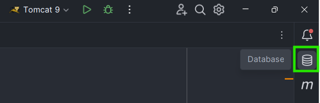

---

## Paso 2 

- Seleccionamos '+', para crear una nueva conexión.
  
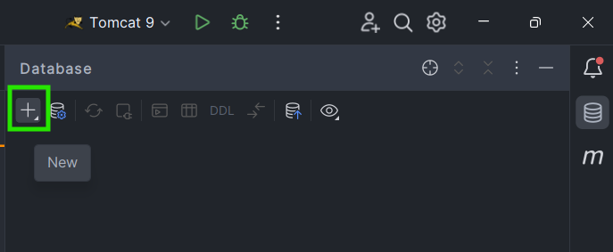

---

## Paso 3 

- Seleccionamos **Data Source**.
- Elegimos **MySQL**.
  
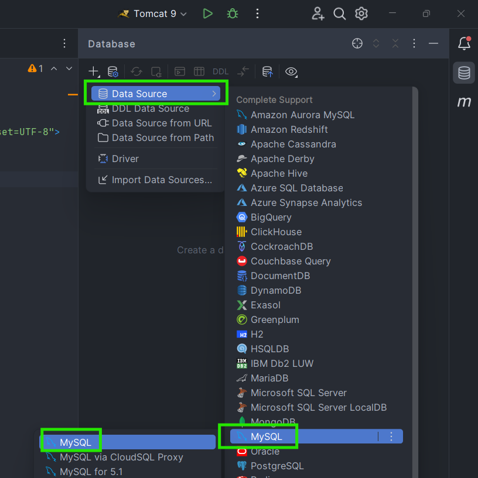

---

## Paso 4 

- Elegimos el tipo de autenticaci&oacute;n. En este caso, **User & password**.
- Introducimos el **nombre de usuario** de nuestra base de datos.
- Introducimos la contrase&ntilde;a.
- Introducumos el nombre de nuestra base de datos.
---
> [!TIP]
> Si introduces solamente nombre de usuario, contrase&ntilde;a y nombre de base de datos el resto de campo se te autocompletar&aacute;n.
---  
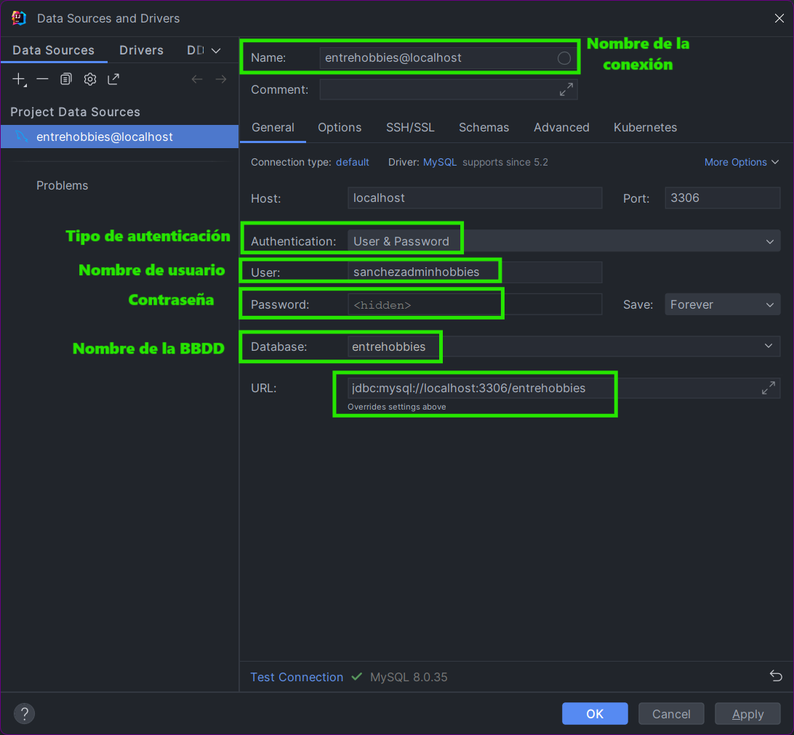

---

## Paso 5 

- Probamos si la conexi&oacute;n es satisfactoria haciendo clic en **Test Connection**.
  
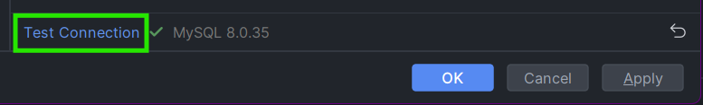

---

## Paso 6

- Si todo est&aacute; correctamente configurado nos aparecer&aacute; el siguente mensaje:
  
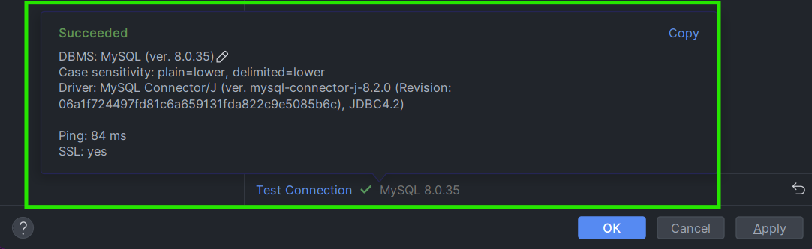

---

## Paso 7

- Ya podemos ver nuestra base de datos en el panel de arriba a la derecha.
  
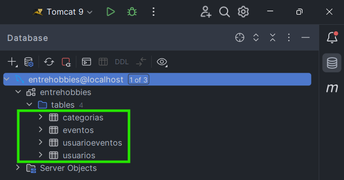

---

## Paso 8

- Si hacemos doble clic sobre una de las tablas se nos mostrar&aacute; su contenido.
  
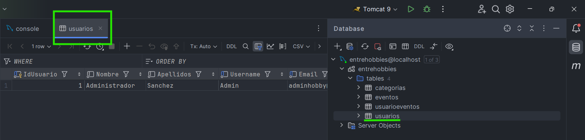

---

> [!NOTE]
> EXTRA - HACER CONSULTAS DESDE INTELLIJ.

---

## Abrir consola

- Pulsamos el simbolo de la consola y seleccionamos **console**.
  
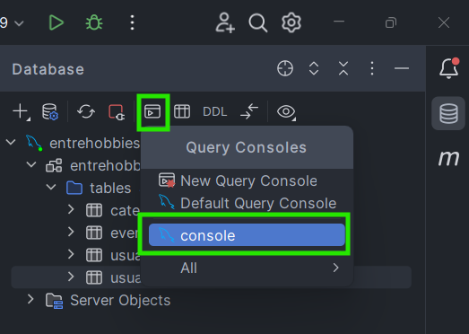

--- 

## Escribir sentencia

- Escribimos la consulta **SQL** que queramos realizar y hacemos clic en el simbolo de **play** verde.

```sql
Select nombre from usuarios;
```  
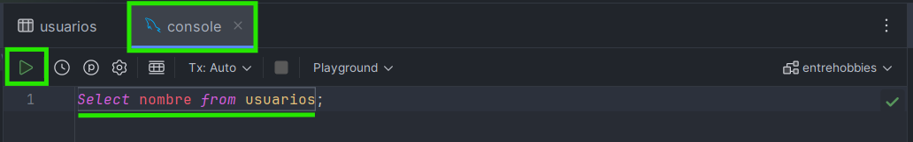

- Y se nos mostrará en la consola el resultado de nuestra sentencia:

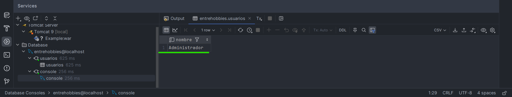
