# Configuraci&oacute;n de Servidor Tomcat 9 en IntelliJ

**Autor:** *Alberto Sánchez Macías*

## Índice

- [Paso 1 - Editar Configuraciones](#paso-1)
- [Paso 2 - Añadir configuración Tomcat Local](#paso-2)
- [Paso 3 - Configurar nombre, versión y navegador](#paso-3)
- [Paso 4 - Ajustar nombre del artefacto](#paso-4)
- [Paso 5 - Configurar acción de actualización](#paso-5)
- [Paso 6 - Seleccionar JDK](#paso-6)
- [Paso 7 - Desplegar aplicación](#paso-7)
- [Paso 9 - Verificar despliegue con modificación](#paso-9)

---

## Versiones ⚙️

- IntelliJ IDEA 2023.3.4
- JDK - Corretto 11(Amazon)
- Servidor - Tomcat 9
- Proyecto Web basado en Maven

---

> [!IMPORTANT]
> 1. La aplicaci&oacute;n debe estar creada y compilada por primera vez en NetBeans.
> 2. Una vez abierta la aplicaci&oacute;n en IntelliJ se debe eliminar el directorio **target**.

---
> [!CAUTION]
> Se recomienda que se sigan todos los pasos en el mismo orden en el que se muestra.

---

## Paso 1 

- Antes que nada, nuestro proyecto no debe contener el directorio **target**.
- Procedemos a configurar el servidor del proyecto.
- Hacemos clic en **Current File** --> **Edit Configurations...**

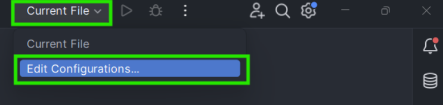

---
## Paso 2

- Seleccionamos **Add new run configurations**.
- Vamos al apartado **Tomcat Server**.
- Elegimos **Local**.

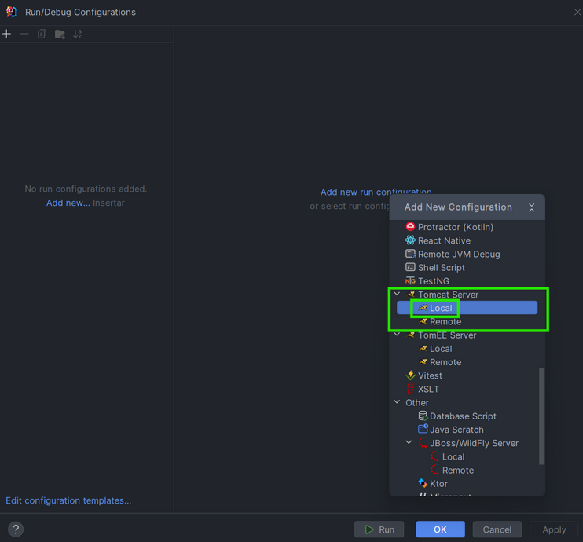

---

## Paso 3

- Configuramos el nombre del servidor. En este caso hemos elegido ***Tomcat 9*** como nombre.
- Seleccionamos la **versión de Tomcat** que vamos a utilizar. Versión --> **9.0.43**
- Elegimos **Chrome** como Open Browser. Va a ser el navegador por defecto donde se va a lanzar nuestra aplicación.
- Y hacemos clic en **Fix**.

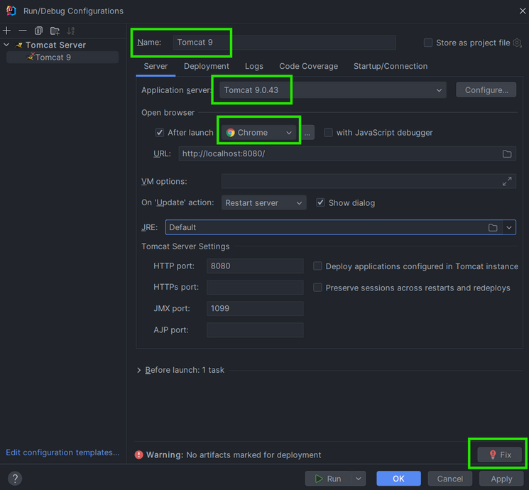

- Seleccionamos el **artefacto** de nuestro proyecto.

---

> [!WARNING]
> Seleccionamos el que **NO** contiene la palabra **exploded**.

---

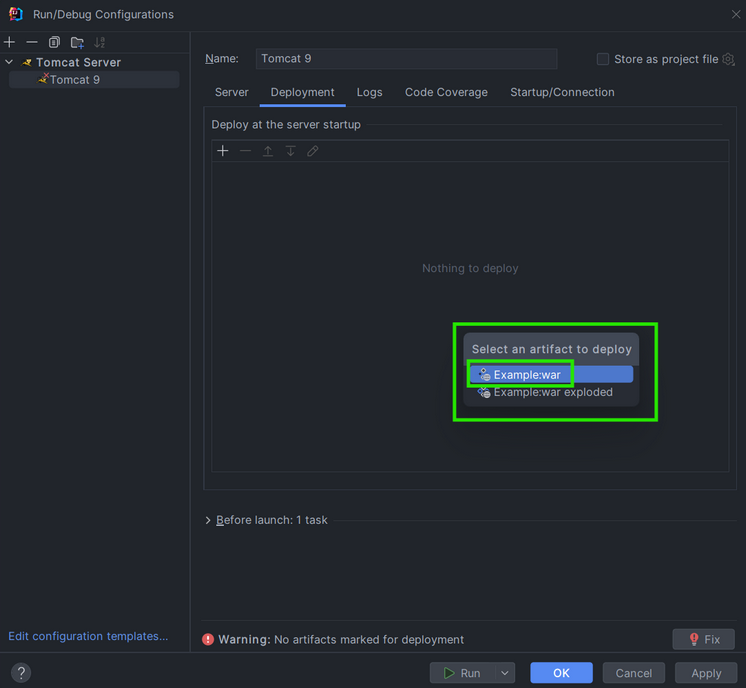

---

## Paso 4

- Eliminamos **_war** y dejamos el nombre de nuestro proyecto.

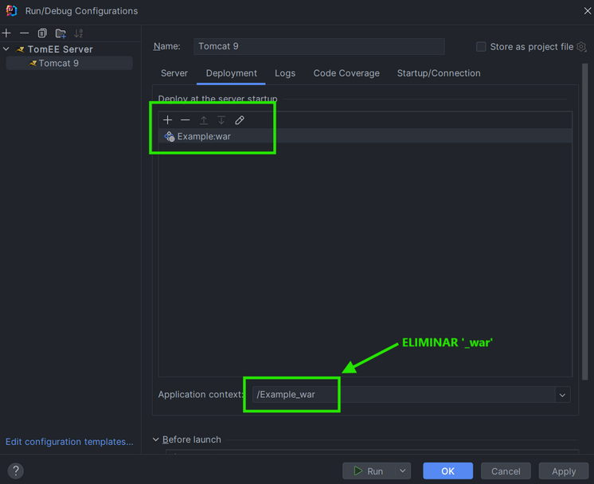
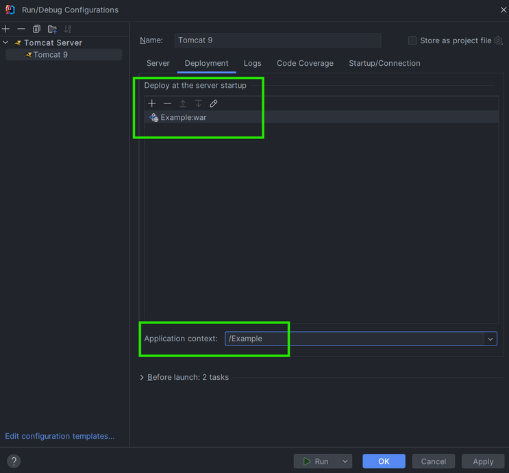

---

## Paso 5

- Seleccionamos la acción que va a realizar nuestro servidor en caso que actualicemos su estado.
- Elegimos **Redeploy**. Básicamente nuestro servidor volverá a desplegar la aplicación.

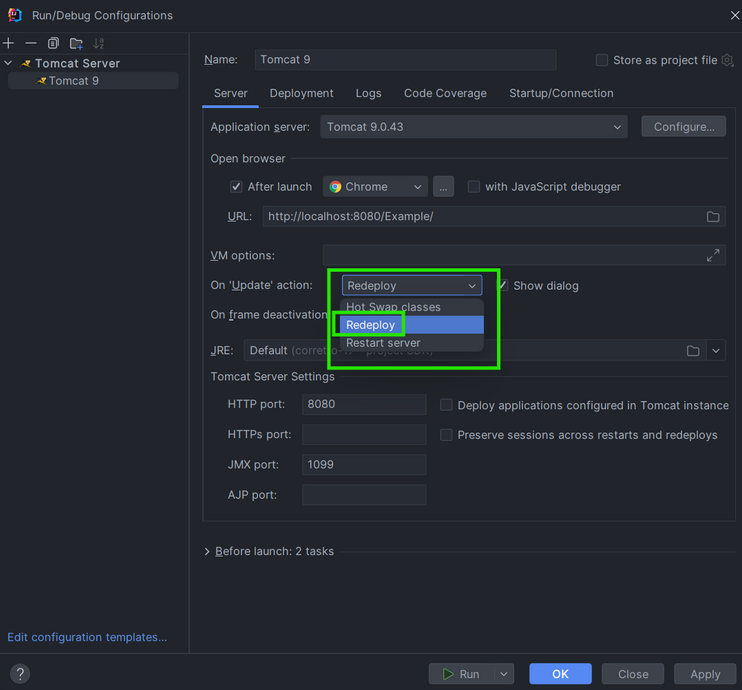

---

## Paso 6

- Elegimos el **JDK** que vamos a utilizar.
- En este caso será **corretto-11** de Amazon.

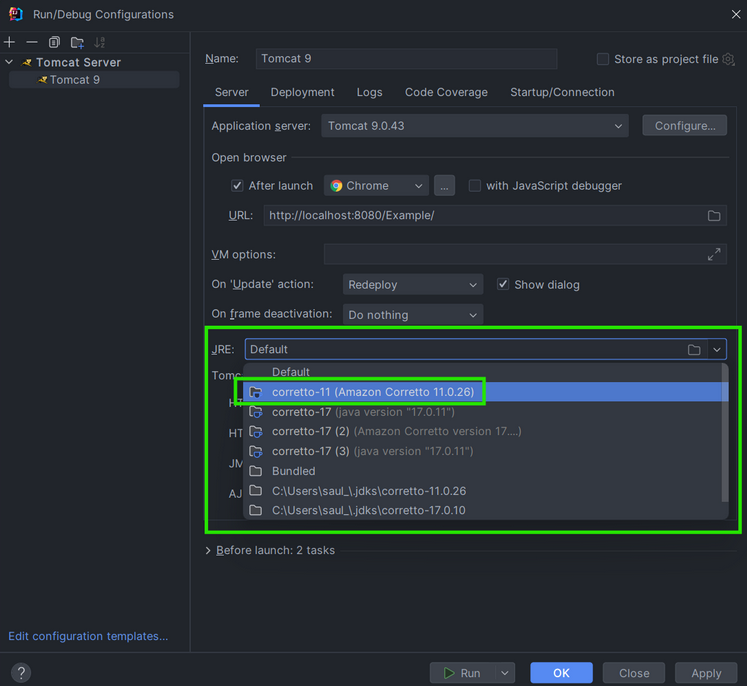

---

## Paso 7

- **Desplegamos** nuestra aplicación.

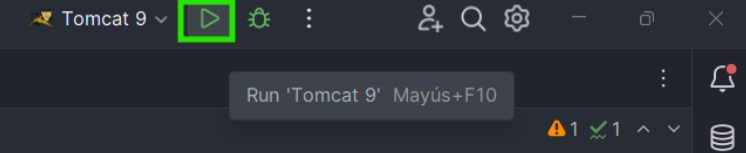

- Si todo se ha configurado correctamente la aplicación se desplegará en el navegador Chrome con la siguientes vista:

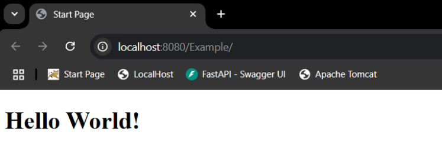

---

## Paso 9

- Comprobamos que el Servidor funciona correctamente.
- Para ello haremos una pequeña modificación en **index.html** o **index.jsp** (Dependiendo del archivo principal que hayas configurado para tu aplicación)

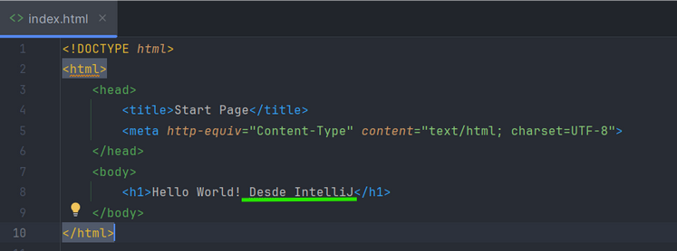

- Hacemos **Redeploy**.

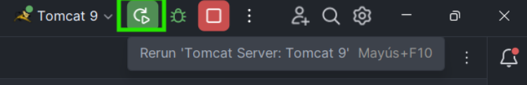

- Y nuestra **vista principal** debería verse con los cambios que hemos realizado anteriormente:

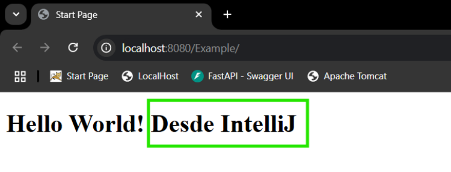

- Si en nuestra vista se ven los cambios aplicados, nuestro **Servidor Tomcat** estará **correctamente** configurado.
