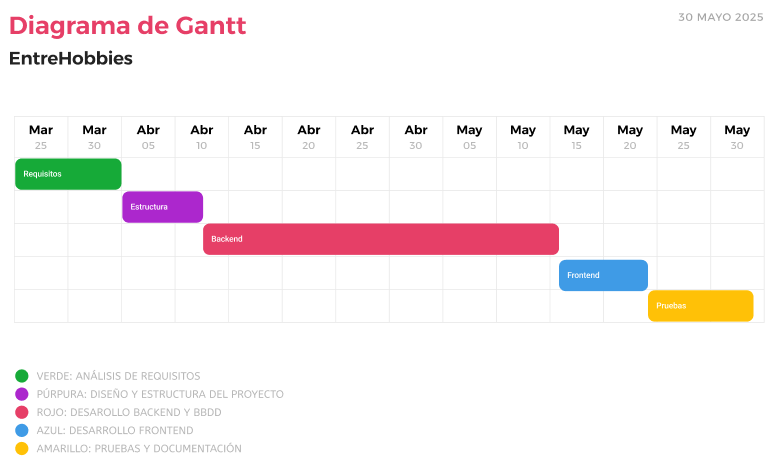

## Diagrama de Gantt 📊

A continuaci&oacute;n se presenta el diagrama de Gantt correspondiente al desarrollo del proyecto **EntreHobbies**. Este cronograma visual refleja la planificaci&oacute;n temporal de cada una de las fases, desde el an&aacute;lisis de requisitos hasta las pruebas finales y la documentaci&oacute;n.

El objetivo de este diagrama es proporcionar una visi&oacute;n clara y estructurada del progreso del proyecto, permitiendo identificar los tiempos asignados a cada tarea y facilitar el seguimiento de hitos importantes durante el proceso de desarrollo.

Cada fase fue planificada de forma consecutiva, permitiendo una transici&oacute;n fluida entre etapas y asegurando que el trabajo se realizara de manera organizada dentro del periodo de dos meses establecido para su ejecuci&oacute;n.

---

---

🧑‍💻**Alumno:** *Alberto Miguel S&aacute;nchez Mac&iacute;as*

🧑‍🏫**Tutor FCT:** *Francisco Mera Calder&oacute;n*

🏫**Instituto:** *IES Albarregas*

🏫**Clase:** *DAW-2B* 
