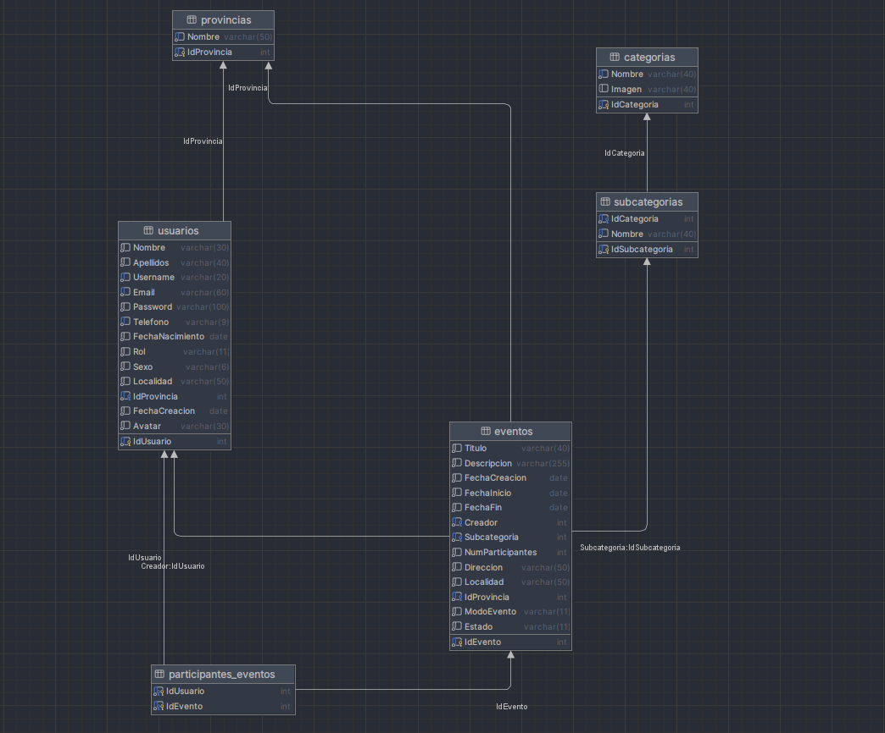

# 📊 Diagrama ER de *EntreHobbies*

> [!NOTE]
> **Este diagrama representa la versión definitiva del modelo.**  
> ~~El diseño actual está en fase de desarrollo y puede estar sujeto a cambios a medida que se implementan nuevas funcionalidades o se refina la estructura de la base de datos~~. 
> ~~Se recomienda revisar futuras actualizaciones para obtener la versión final~~.

### Estado del modelo: *30/05/2025*

Este es el **Diagrama Entidad-Relación** actualizado a fecha **23 de abril de 2025**, que representa las relaciones entre las tablas principales de la base de datos del proyecto *EntreHobbies*:

---

## ℹ️ Informaci&oacute;n del proyecto:

🧑‍💻**Alumno:** *Alberto Miguel S&aacute;nchez Mac&iacute;as*

🌐**Aplicaci&oacute;n:** *EntreHobbies*

🧑‍🏫**Tutor FCT:** *Francisco Mera Calder&oacute;n*

🏫**Instituto:** *IES Albarregas*

🏫**Clase:** *DAW-2B* 
