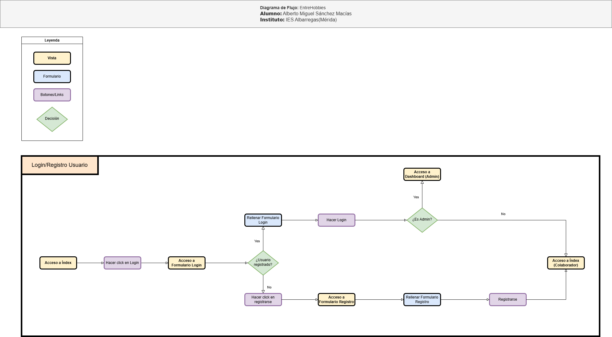

# DIAGRAMA DE FLUJO - ENTREHOBBIES

- Inicialmente, se separar&aacute;n las diferentes ***acciones*** que se realizarán en la aplicaci&oacute;n.
- Se detallar&aacute; el flujo de cada ***acci&oacute;n***, indicando el nombre correspondiente en la esquina superior izquierda.
- El diagrama incluye una **leyenda** que explica los distintos elementos que pueden aparecer en el flujo.

---

> [!WARNING]
> - Esta no es la versi&oacute;n final del diagrama de flujo de la aplicaci&oacute;n.
> - Actualmente el diagrama est&aacute; en fase de **desarrollo**.
> - Pendiente de **revisi&oacute;n** por el tutor.

---

Diagrama actualizado a d&iacute;a **24/04/2025**:

