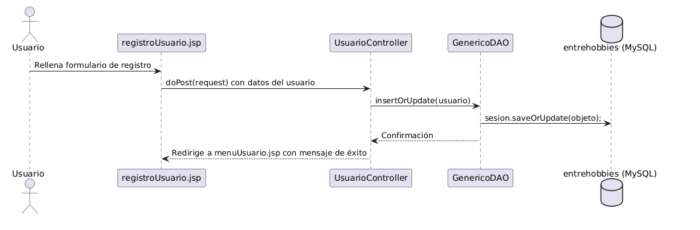
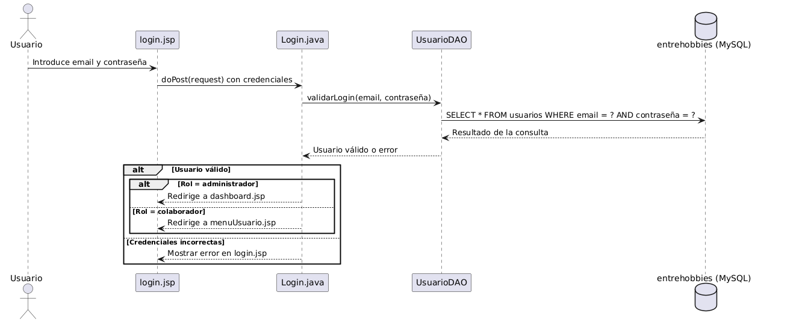
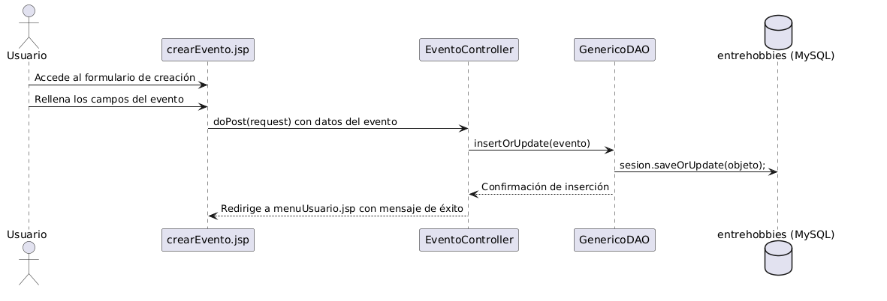
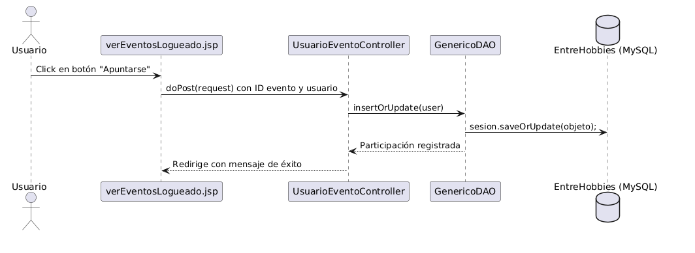
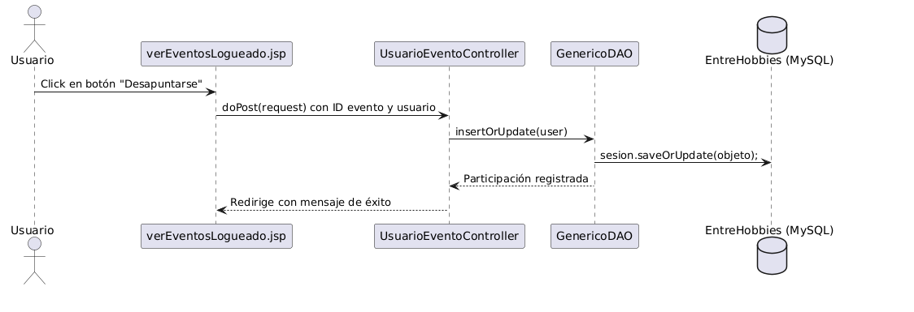

# Diagramas de Secuencia de la Aplicación: *EntreHobbies*

>[!NOTE]
> Este documento presenta los diferentes casos de uso contemplados dentro de la aplicación **EntreHobbies**, representados mediante diagramas de secuencia. En ellos se detallan las funcionalidades principales y las responsabilidades de cada componente del sistema, reflejando cómo interactúan los usuarios con la plataforma en los distintos procesos clave.

---

## Índice

1. [Diagrama de Secuencia - Registro de usuario](#diagrama-de-secuencia---registro-usuario)
2. [Diagrama de Secuencia - Login de usuario](#diagrama-de-secuencia---login-usuario)
3. [Diagrama de Secuencia - Crear evento](#diagrama-de-secuencia---crear-evento)
4. [Diagrama de Secuencia - Apuntarse a evento](#diagrama-de-secuencia---apuntarse-a-evento)
5. [Diagrama de Secuencia - Desapuntarse de un evento](#diagrama-de-secuencia---desapuntarse-de-un-evento)

---

## Diagrama de Secuencia - Registro de usuario

---

## Diagrama de Secuencia - Login de usuario

---

## Diagrama de Secuencia - Crear evento

---

## Diagrama de Secuencia - Apuntarse a evento

---

## Diagrama de Secuencia - Desapuntarse de un evento

---

🧑‍💻**Alumno:** *Alberto Miguel S&aacute;nchez Mac&iacute;as*

🧑‍🏫**Tutor FCT:** *Francisco Mera Calder&oacute;n*

🏫**Instituto:** *IES Albarregas*

🏫**Clase:** *DAW-2B* 

🔗 **Aplicaci&oacute;n utilizada para la creación de los diagramas:** [PlantUML](https://plantuml.com/es/)
