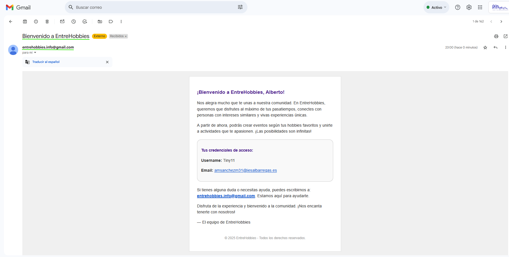
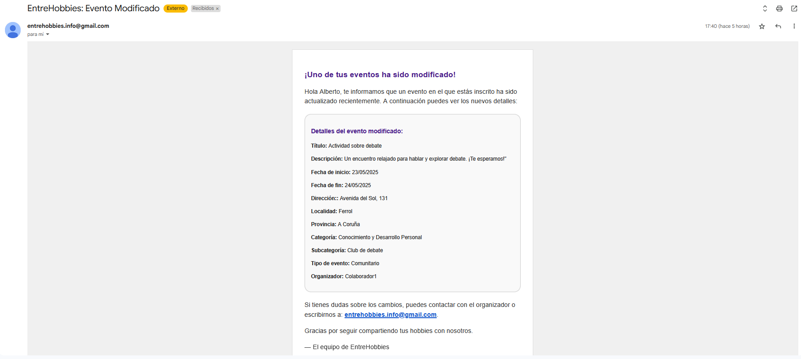
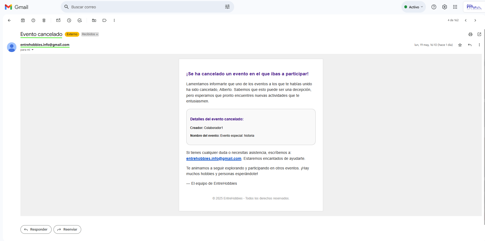

## 📧 Funcionalidad de Env&iacute;o de Emails en la Aplicaci&oacute;n

>[!NOTE]
>Este documento describe la funcionalidad de env&iacute;o autom&aacute;tico de correos electr&oacute;nicos implementada en la aplicaci&oacute;n ***EntreHobbies***.  
>Su objetivo es mantener informados a los usuarios sobre eventos importantes relacionados con su actividad en la plataforma, como registros, modificaciones o cancelaciones de eventos.  
>Los mensajes son generados din&aacute;micamente y enviados a trav&eacute;s del servicio de correo configurado en el backend.

---

### Índice

1. [👋🏼 Env&iacute;o de Email - Bienvenida a Nuevo Usuario](#-envío-de-email---bienvenida-a-nuevo-usuario)  
2. [🔔 Env&iacute;o de Email - Evento Modificado](#-envío-de-email---evento-modificado)  
3. [❌ Env&iacute;o de Email - Evento Cancelado](#-envío-de-email---evento-cancelado)

---

### 👋🏼 Env&iacute;o de Email - Bienvenida a Nuevo Usuario

- Este correo se env&iacute;a automáticamente cuando un usuario completa su registro en la plataforma.  
- Contiene un saludo personalizado, un resumen de las funcionalidades de la plataforma y las credenciales de acceso del usuario.



---

### 🔔 Env&iacute;o de Email - Evento Modificado

- Este correo se env&iacute;a a todos los participantes de un evento cuando el organizador realiza una modificaci&oacute;n relevante.  
- Incluye los nuevos detalles del evento: t&iacute;tulo, fechas, direcci&oacute;n, categor&iacute;a y organizador.



---

### ❌ Env&iacute;o de Email - Evento Cancelado

- Este correo se env&iacute;a a todos los inscritos cuando un evento ha sido cancelado por su organizador.  
- Informa al usuario de la cancelaci&oacute;n y ofrece canales de contacto para resolver dudas.



---

### 🛠️ Dependencia utilizada para esta funcionalidad:

```java
<dependency>
    <groupId>com.sun.mail</groupId>
    <artifactId>jakarta.mail</artifactId>
    <version>2.0.1</version>
</dependency>
```

---

## ℹ️ Informaci&oacute;n del proyecto:

🧑‍💻**Alumno:** *Alberto Miguel S&aacute;nchez Mac&iacute;as*

🌐**Aplicaci&oacute;n:** *EntreHobbies*

🧑‍🏫**Tutor FCT:** *Francisco Mera Calder&oacute;n*

🏫**Instituto:** *IES Albarregas*

🏫**Clase:** *DAW-2B* 
