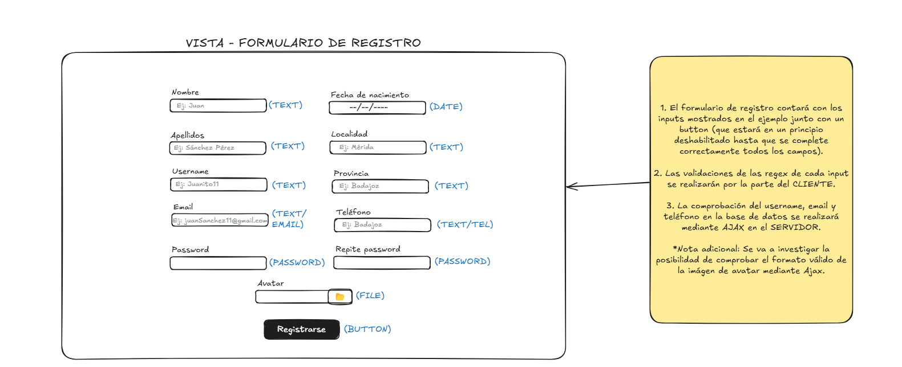
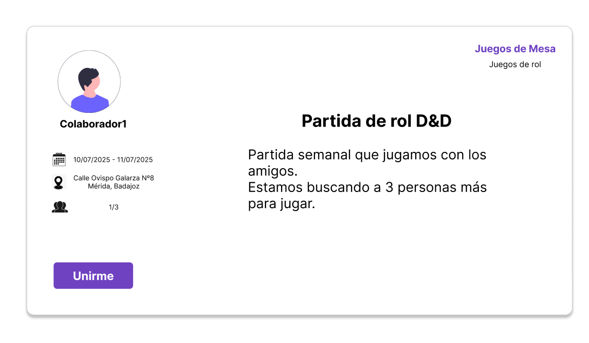

# Ideas para los Componentes de la Web 💡

>[!NOTE]
> Este documento recoge las ideas iniciales y conceptos clave para los componentes principales de la web. Se describen los elementos que me gustar&iacute;a incluir, su funcionalidad prevista y c&oacute;mo mejorar&aacute;n la experiencia del usuario.
> ⚠️ Son ideas iniciales, los componentes están sujetos a cambios en la versi&oacute;n final.

## Framework Utilizado para el dise&ntilde;o

  
  
Figma

---

## Formulario Login 📝👤

---

## Formulario Registro de nuevo usuario 📝🆕👤

---

## Carta de Eventos 🪪

